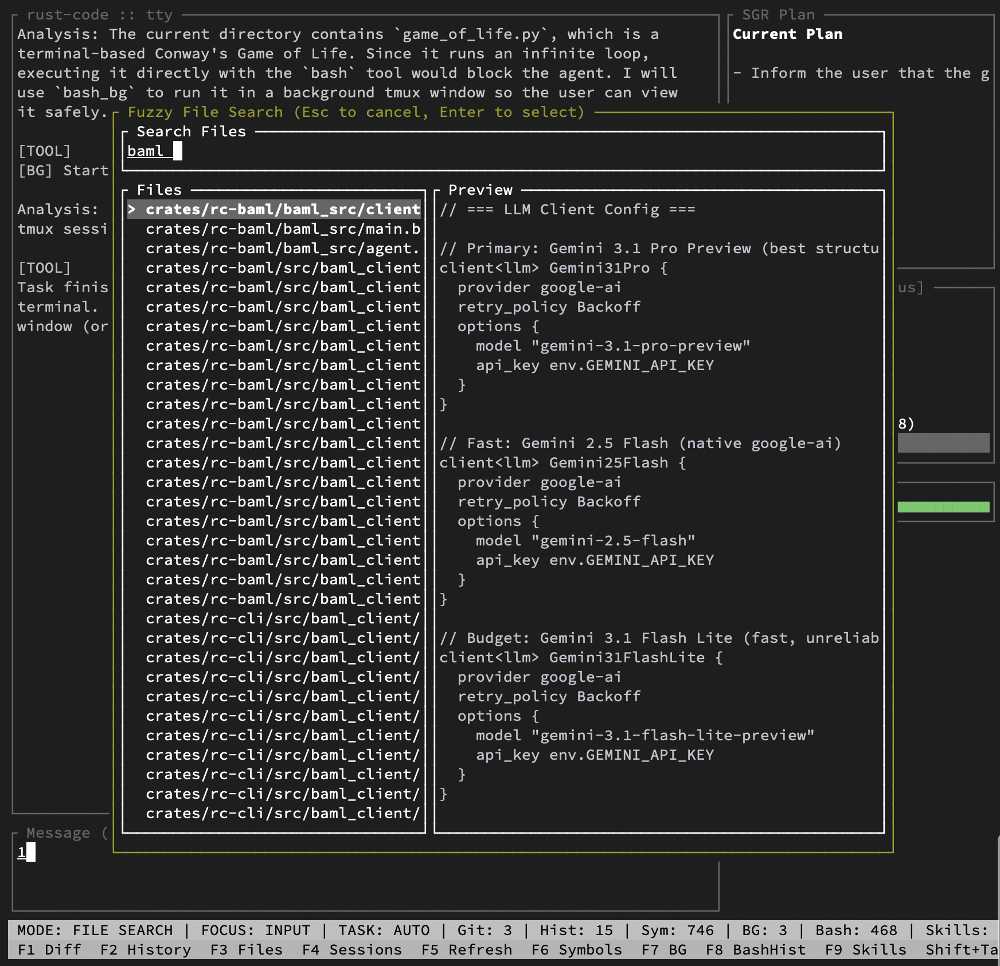
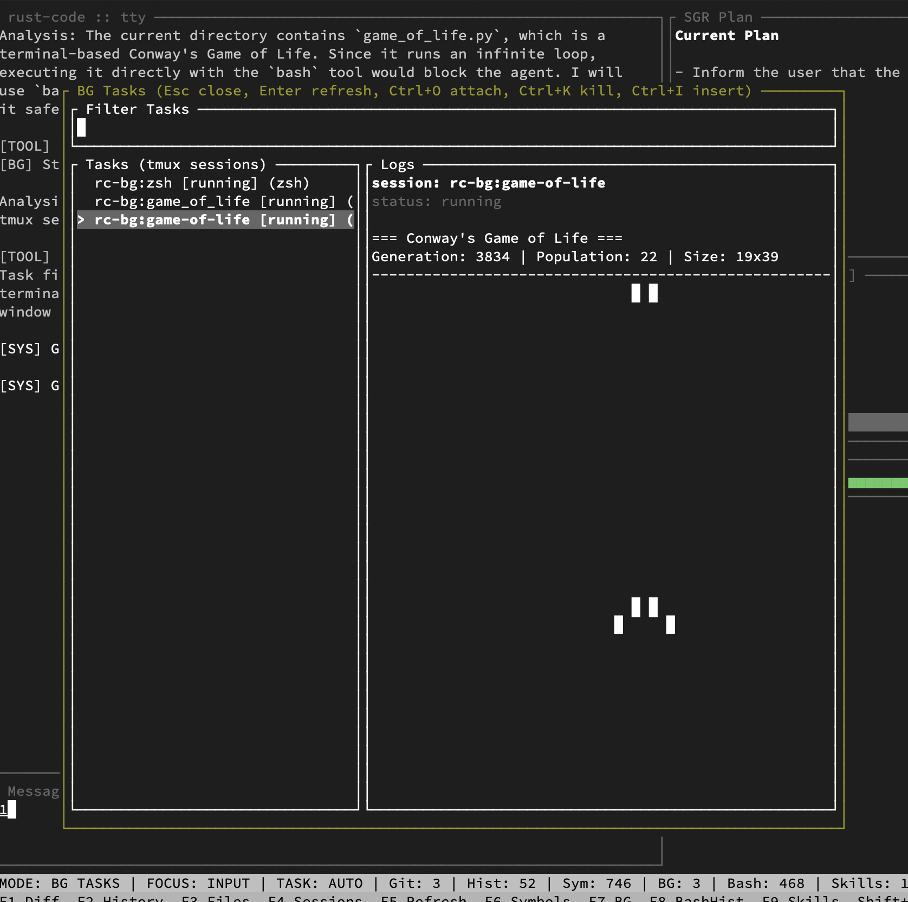
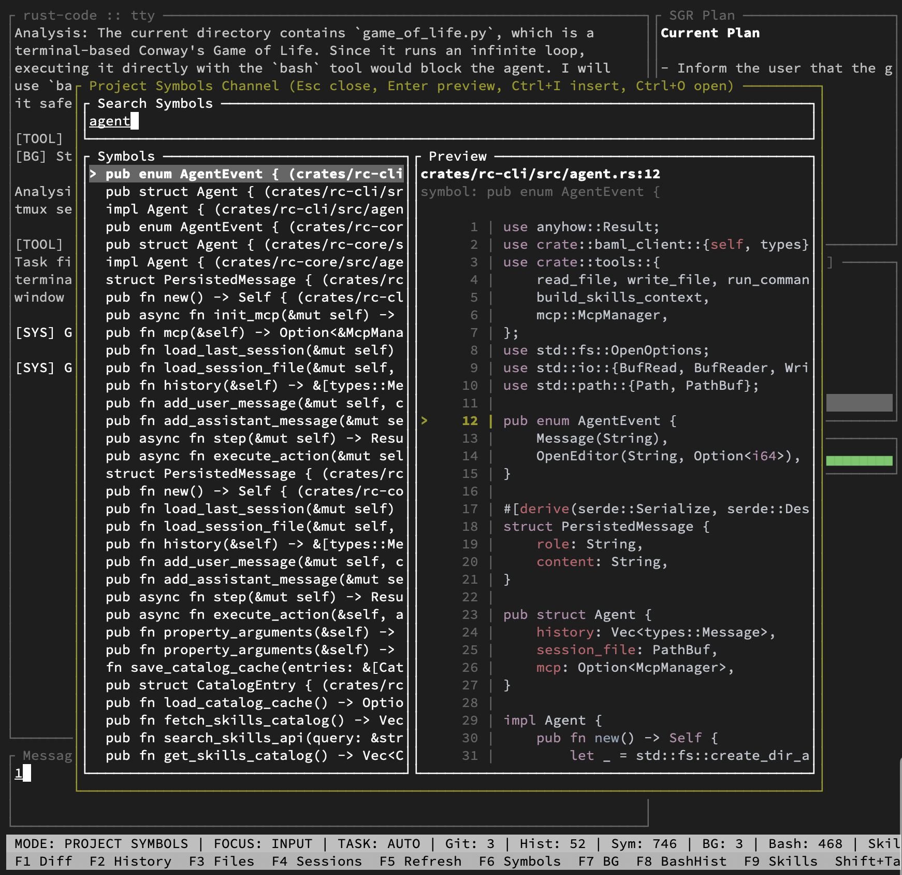
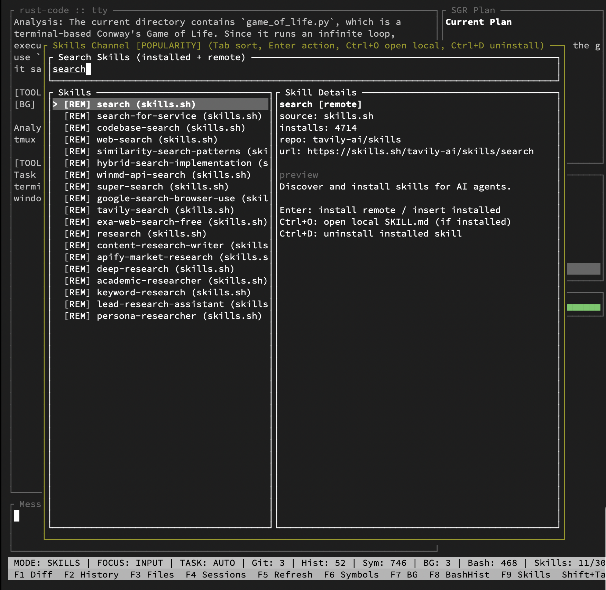

# rust-code

[](https://crates.io/crates/rust-code)
[](https://github.com/fortunto2/rust-code/releases)
[](LICENSE)

`rust-code` is a terminal coding agent written in Rust.

It combines a Ratatui-based TUI, typed tool execution, fuzzy navigation, session history, and a BAML-driven agent loop so you can work on a codebase without leaving the terminal.



<p align="center">
  
  
  
</p>

## Install

One-liner (downloads binary + installs dependencies via `doctor`):

```bash
curl -fsSL https://raw.githubusercontent.com/fortunto2/rust-code/master/install.sh | bash
```

Or from crates.io:

```bash
cargo install rust-code
rust-code doctor --fix   # installs tmux, ripgrep, etc.
```

Run it:

```bash
rust-code                                          # interactive TUI
rust-code --prompt "Find the bug in src/main.rs"   # headless mode
rust-code --resume                                 # continue last session
```

## Features

- **Interactive TUI** — chat UI built with `ratatui` and `crossterm`
- **BAML agent loop** — typed tool execution with fallback chain (Gemini Pro → Flash → Flash Lite)
- **14 built-in tools** — file read/write/edit, bash, search, git status/diff/add/commit, and more
- **Fuzzy file search** (`Ctrl+P`) — fast file navigation with `nucleo` and live file preview
- **Project symbol search** (`F6`) — browse functions, structs, enums with code preview
- **Background tasks** (`F7`) — run long commands in `tmux` windows with realtime output preview
- **Skills system** (`F9`) — browse, search, and install agent skills from [skills.sh](https://skills.sh) registry
- **MCP support** — connect external tool servers via `.mcp.json` (e.g. Playwright, codegraph, Supabase)
- **Git integration** — diff sidebar, history viewer, stage and commit from the agent
- **Session persistence** — chat history in `.rust-code/session_*.jsonl`, resume with `--resume`
- **Open-in-editor** — jump to file:line in `$EDITOR` from any panel

### Background Tasks (tmux)

The agent can run long-lived commands (dev servers, watchers, builds) in named `tmux` windows via `BashBgTool`. Press `F7` to see all running tasks with realtime log output. `Ctrl+O` to attach, `Ctrl+K` to kill.

Requires `tmux` installed (`brew install tmux`).

### Skills

Skills are reusable agent instructions (markdown files) that teach the agent domain-specific workflows. Browse the [skills.sh](https://skills.sh) registry with `F9`, or from CLI:

```bash
rust-code skills search "deploy"
rust-code skills add tavily-ai/skills/web-search
```

Installed skills are injected into the agent context automatically.

### MCP (Model Context Protocol)

Connect external tool servers by adding `.mcp.json` in your project or home directory:

```json
{
  "mcpServers": {
    "playwright": {
      "command": "npx",
      "args": ["@playwright/mcp@latest"]
    }
  }
}
```

The agent discovers MCP tools at startup and can call them via `McpToolCall`.

## Provider Setup

The current build is configured for these LLM backends:

- Google AI via `GEMINI_API_KEY`
- Vertex AI via `GOOGLE_CLOUD_PROJECT`
- OpenRouter via `OPENROUTER_API_KEY`

At least one of them must be configured in your environment before launching `rust-code`.

Examples:

```bash
export GEMINI_API_KEY="..."
rust-code
```

```bash
export GOOGLE_CLOUD_PROJECT="my-project"
rust-code
```

```bash
export OPENROUTER_API_KEY="..."
rust-code
```

Notes:

- BAML clients are defined in [`crates/rc-baml/baml_src/clients.baml`](crates/rc-baml/baml_src/clients.baml).
- Default: Gemini 3.1 Pro with fallback to Flash and Flash Lite.
- `BAML_LOG` is suppressed automatically by the app so the TUI stays clean.

## Quick Start

1. `cd` into the repository you want to work on.
2. Create an `AGENTS.md` file in that repo.
3. Export one provider credential.
4. Launch `rust-code`.
5. Start with a direct task like `review this repo`, `fix the failing test`, or `add a new command`.

## AGENTS.md

`rust-code` works best when the target repository contains an `AGENTS.md` file with project-specific instructions.

Recommended contents:

- stack and framework versions
- architecture constraints
- code style rules
- test/build commands
- migration or release rules
- prompt or tool-schema rules
- file locations that must be edited first

Example:

```md
# Agent Instructions

## Stack
- Rust 2024
- Tokio
- Ratatui

## Rules
- Prefer minimal patches
- Run `cargo check` after code changes
- Do not edit generated files directly
- Put prompt/schema changes under `crates/rc-baml/baml_src/`

## Commands
- Build: `cargo build`
- Check: `cargo check`
- Test: `cargo test`
```

The more concrete this file is, the better the agent performs.

## Sessions and Local State

`rust-code` stores local state in `.rust-code/`:

- `.rust-code/context/` for persistent agent guidance files
- `.rust-code/session_*.jsonl` for chat/session history

Use `--resume` to reopen the latest saved session:

```bash
rust-code --resume
```

## TUI Shortcuts

Main shortcuts currently exposed by the UI:

- `Enter`: send message
- `Ctrl+P`: file search
- `Ctrl+H`: session history
- `Ctrl+G`: refresh git sidebar
- `Tab`: focus sidebar
- `Ctrl+C`: quit
- `F1`: diff channel
- `F2`: git history
- `F3`: files
- `F4`: sessions
- `F5`: refresh
- `F6`: symbols
- `F7`: background tasks
- `F10`: channels
- `F12`: quit

Inside side panels:

- `Esc`: close panel
- `Ctrl+I`: insert selected item into the prompt
- `Ctrl+O`: open or attach, where supported

Background tasks are backed by `tmux`, so having `tmux` installed is useful if you want long-running task inspection from the UI.

## CLI

```text
Usage: rust-code [OPTIONS]

Options:
  -p, --prompt <PROMPT>
  -r, --resume
  -h, --help
  -V, --version
```

## Development

This repository now publishes a single crate, `rust-code`, but it still keeps a logical split in the source tree for the agent loop, tools, and generated BAML client code.

If you change BAML source files, edit them in:

- [`crates/rc-baml/baml_src/`](crates/rc-baml/baml_src/)

Then regenerate:

```bash
~/.cargo/bin/baml-cli generate --from crates/rc-baml/baml_src
rm -rf crates/rc-cli/src/baml_client && cp -r crates/rc-baml/src/baml_client crates/rc-cli/src/baml_client
```

See [`crates/rc-baml/README.md`](crates/rc-baml/README.md) for the full BAML prompt writing guide.

Useful commands:

```bash
cargo check
cargo build
cargo test
```

## Built With

| What | Crate / Link |
|------|-------------|
| Agent architecture | [Schema-Guided Reasoning (SGR)](https://abdullin.com/schema-guided-reasoning/) — typed tool dispatch via union types |
| LLM prompt engineering | [BAML](https://github.com/BoundaryML/baml) — DSL for type-safe structured output from LLMs |
| TUI framework | [Ratatui](https://github.com/ratatui/ratatui) + [Crossterm](https://github.com/crossterm-rs/crossterm) |
| Text input | [tui-textarea](https://github.com/rhysd/tui-textarea) |
| Fuzzy search | [Nucleo](https://github.com/helix-editor/nucleo) (from Helix editor) |
| Async runtime | [Tokio](https://tokio.rs) |
| MCP client | [rmcp](https://github.com/anthropics/rust-sdk) — Rust SDK for Model Context Protocol |
| CLI | [Clap](https://github.com/clap-rs/clap) |
| File traversal | [ignore](https://github.com/BurntSushi/ripgrep/tree/master/crates/ignore) (from ripgrep, respects `.gitignore`) |
| Skills registry | [skills.sh](https://skills.sh) |
| Background tasks | [tmux](https://github.com/tmux/tmux) |

## Status

The crate is published on crates.io:

- https://crates.io/crates/rust-code

Release artifacts (Linux x86_64 + macOS aarch64) are published on GitHub when you push a tag matching `v*`.
